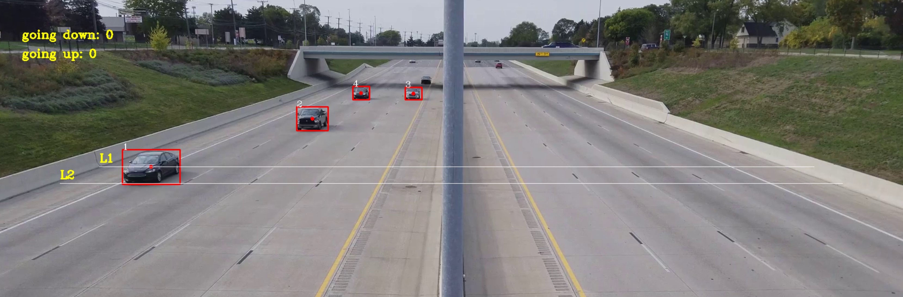
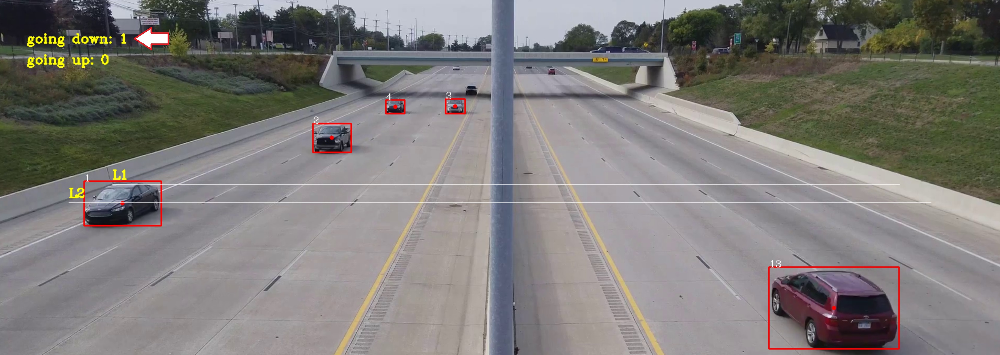
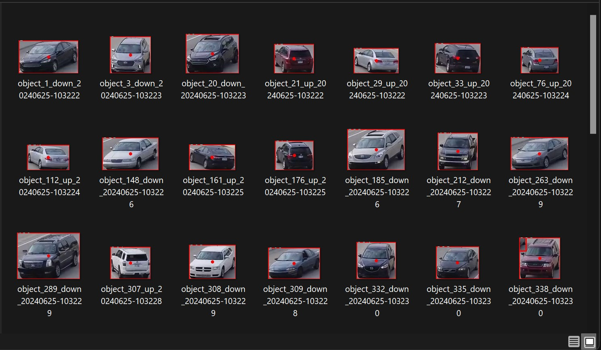
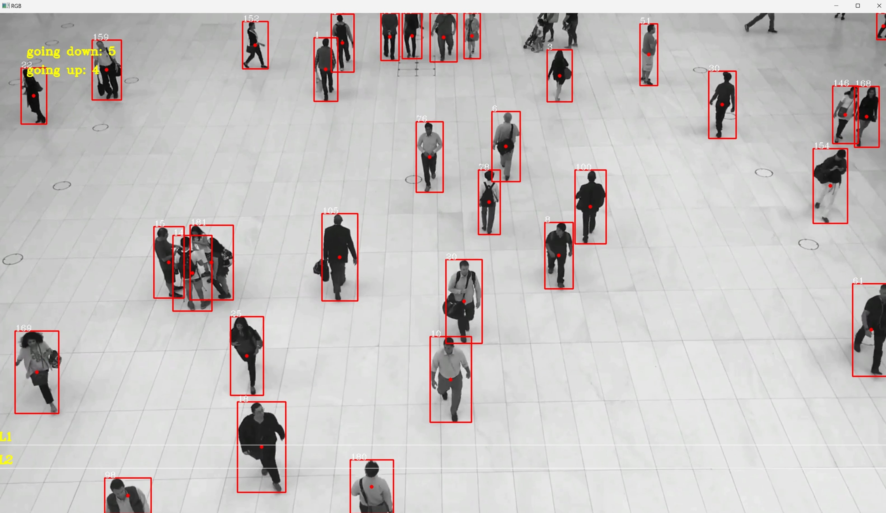
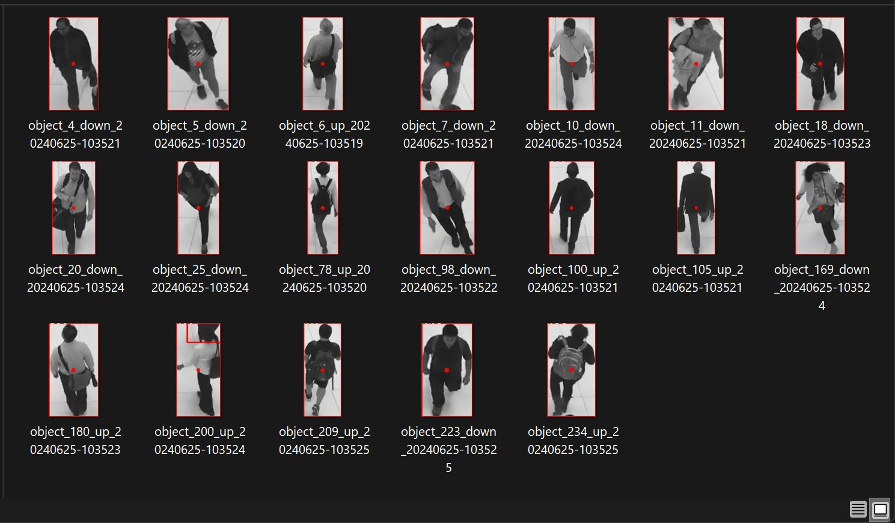

# 🔢👁️Realtime Object Detection & Counting with YOLOv8
This project aims to understand how to count objects in computer vision tasks. Object counting is a computer vision technique that involves identifying and counting objects in images or video frames. 

This project uses YOLOv8 to detect objects and track their movement across lines to count them. The script is able to detects objects and also counts them as they move through the video.

Additionally, it saves screenshots of the detected objects along with their timestamps.

## How Counting is Performed
The counting mechanism works by defining two lines (L1 and L2) in the video frame. The center point of the bounding box of each detected object is tracked. As this center point moves across these lines, the direction of movement is determined, and the object is counted based on the order in which the lines are crossed:

<div style="text-align: center;">

</div>

<div style="text-align: center;">

</div>

1. **Going Down**:
   - If the center point of an object's bounding box crosses line L1 first and then crosses line L2, it is counted as moving "down".
2. **Going Up**:
   - If the center point of an object's bounding box crosses line L2 first and then crosses line L1, it is counted as moving "up".

This approach ensures that each object is counted based on its movement direction, providing an accurate count for both directions.
   
The system also saves images of the detected objects in the directory specified, including the timestamp, to help with further analysis:

<div style="text-align: center;">

</div>

It is also applicable to other use cases, such as counting people (just change the value of `CLASS_TO_DETECT` inside .env file):
<div style="text-align: center;">

</div>
<div style="text-align: center;">

</div>

## 🏗️ Implementation Components
I used the following components:
1. **YOLOv8**: A state-of-the-art object detection model.
2. **OpenCV**: A library for real-time computer vision.
3. **Custom Object Tracker**: A class implementing the tracking algorithm to maintain object IDs across frames.

## 🛠️ Setup and Local Deployment
1. **Clone the repository and navigate to the project directory**:
    ```sh
    git clone https://github.com/enricollen/object-detection-counting
    cd object-detection-counting
    ```

2. **Create a virtual environment**:
    ```sh
    python -m venv venv
    source venv/bin/activate  # On Windows, use `venv\Scripts\activate`
    ```

3. **Install the required libraries**:
    ```sh
    pip install -r requirements.txt
    ```

5. **Run the application**:
    ```sh
    python main.py
    ```

6. **View the results**:
    - The processed video frames will be displayed, and images of detected objects will be saved in the specified folder.

## 🚀 Future Improvements
Here are some ideas for future improvements:
- [ ] Improve tracking algorithm for better accuracy.
- [ ] Add support for multiple object classes to track simultaneously.

## 📹 Demo Video
Watch the demo video below to see the object detection and counting system in action:
[](https://youtu.be/vpVyQycCNkc)

(if you enjoyed this content, please consider leaving a star ⭐)
